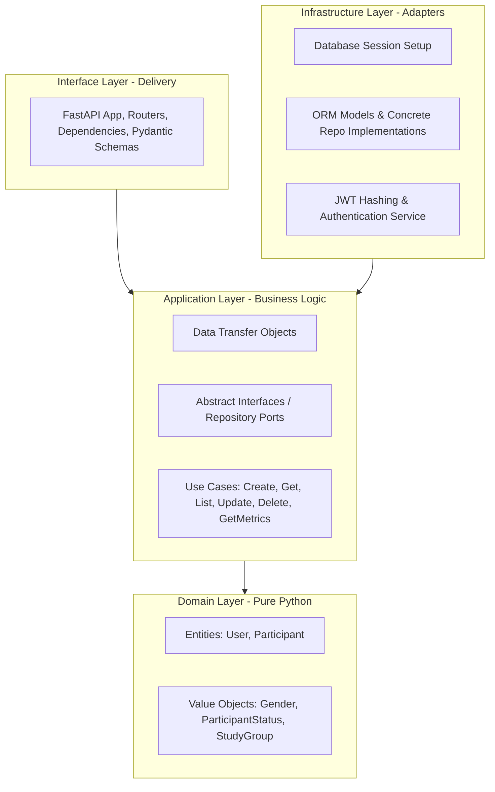

# Clinical Trial Data Dashboard

This repository contains a full stack application built to visualize and manage clinical trial participant metrics and records.

---

## Repository Structure

The monorepo structure contains:

* backend/: Python (FastAPI + SQLAlchemy + SQLite) backend API managing trial participant records and dashboard metrics.
* frontend/: React + Vite web dashboard client displaying metrics charts and participant CRUD grids.

---

## Architecture and Component Design

The application follows Clean Architecture / Hexagonal Architecture principles to separate core business rules from infrastructure and delivery details.



---

## Technologies Used and Rationale

1. **FastAPI**: Used as the Python web framework for its high performance, support for asynchronous operations, automatic OpenAPI documentation, and robust Pydantic data validation.
2. **React + Vite**: Chosen for the frontend to enable modular component design, state management, and optimized asset bundling.
3. **SQLAlchemy & AioSQLite**: Leveraged as the database ORM to execute non-blocking, asynchronous read/write operations against the database.
4. **SQLite**: Used as the database engine for local simplicity. Transitioning to a production database engine like PostgreSQL is trivial as it only requires swapping the DATABASE_URL settings.
5. **Pytest & Pytest-Asyncio**: Used as the testing framework to run isolated test suites on an in-memory SQLite database.
6. **Passlib & Cryptography**: Implemented secure password hashing (Bcrypt) and JSON Web Token (JWT) signatures.

---

## How to Run the Application

### Option A: Using Docker and Docker Compose (Recommended)
You can run the entire stack (both frontend and backend services) inside a containerized environment.

1. **Build and start the containers**:
   ```bash
   docker compose up --build
   ```
2. The application will initialize the database tables and start up:
   * **Frontend Client Dashboard**: http://localhost:3000
   * **Backend API Swagger Specs**: http://localhost:8000/docs
   * **Backend API raw endpoint**: http://localhost:8000/

### Option B: Running Locally
If you prefer running the services locally on your host machine:

#### Running the Backend:
1. Set up a Python virtual environment:
   ```bash
   cd backend
   python3 -m venv .venv
   source .venv/bin/activate
   ```
2. Install the backend dependencies:
   ```bash
   pip install -r requirements.txt
   ```
3. Run the FastAPI development server:
   ```bash
   uvicorn main:app --reload
   ```

#### Running the Frontend:
1. Navigate to the frontend directory:
   ```bash
   cd frontend
   ```
2. Install the node packages:
   ```bash
   npm install
   ```
3. Run the Vite development server:
   ```bash
   npm run dev
   ```

---

## How to Test

### Running Backend Tests:
The backend contains automated integration and unit tests validating JWT authentication, participant creation constraints, status transitions, and metric aggregation.

To execute the tests (ensure the python virtual environment is active):
```bash
cd backend
PYTHONPATH=. pytest
```

### Running Frontend Tests:
To verify the React application builds cleanly with no compile errors:
```bash
cd frontend
npm run build
```

---

## Verification of Protected API Routes

All participant endpoints require bearer token authentication. Follow these steps to verify routes:

1. **Register a User**:
   * Endpoint: `POST /auth/register`
   * JSON Payload:
     ```json
     {
       "username": "researcher",
       "password": "securepassword123"
     }
     ```
2. **Login to Obtain a JWT Token**:
   * Endpoint: `POST /auth/token`
   * Form-urlencoded parameters:
     * `username`: `researcher`
     * `password`: `securepassword123`
   * Returns a JSON object containing the `access_token`.
3. **Make Authorized Requests**:
   * Include the token in your headers: `Authorization: Bearer <TOKEN>`
   * **List Participants**: `GET /participants/`
   * **Create Participant**: `POST /participants/`
     * JSON Payload:
       ```json
       {
         "subject_id": "SUB-001",
         "study_group": "treatment",
         "enrollment_date": "2026-06-12",
         "status": "active",
         "age": 45,
         "gender": "F"
       }
       ```
   * **Dashboard Metrics**: `GET /participants/metrics`
   * **Update Participant**: `PUT /participants/{participant_id}`
   * **Delete Participant**: `DELETE /participants/{participant_id}`

---

## Completed Tasks and Trade-offs

### What Was Completed:
* Decoupled backend utilizing Clean Architecture principles.
* JWT authentication router (user register, login).
* Complete participant CRUD operations (Create, Read, Update, Delete).
* A metrics aggregation use case yielding study splits, average ages, status ratios, and gender breakdowns.
* A structured HTTP request logger and global exception middleware.
* An isolated database test suite with 100% passing tests.
* A multi-page React dashboard built with state-based routing and vanilla CSS variables.
* Multi-stage Docker builds orchestrating Node, Python, and Nginx.

### Trade-offs:
* **SQLite for Database Storage**: SQLite was selected over PostgreSQL to simplify local Docker configuration. SQLite is fully compatible with SQLAlchemy and runs asynchronously via aiosqlite, which makes it simple to run locally while keeping the schema completely modular for database engine changes.

---


## AI Tools Used

This project was built with the assistance of the AI developer **Claude AI**. It assisted in:

* Designing the custom vanilla CSS variables and responsive dashboard grids.
* Setting up testing transactions on in-memory sqlite fixtures.
* Reviewing the code for best practices and suggesting improvements.
* Building a clean README
  
